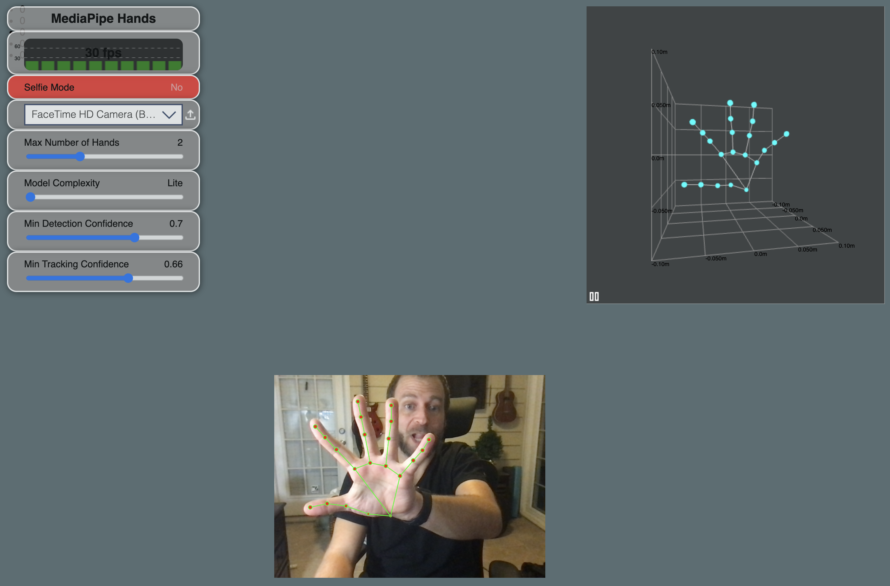

# media-pipe-hand-tracking
21 landmarks in 3D with multi-hand support, based on high-performance palm detection and hand landmark model

       

## Contact

__Jon Christie__ 

GitHub: [mathcodes](https://github.com/mathcodes) 

[<code></code>](https://www.linkedin.com/jonchristie)       
[<code></code>](https://twitter.com/jonpchristie)       
[<code></code>](https://www.youtube.com/channel/UC5GFnN-lv8Yuqc9O3b79k6g)       
[<code></code>](https://www.facebook.com/jonpchristie)       
[<code></code>](https://www.instagram.com/fullstack11235)       
[<code></code>](https://soundcloud.com/jonchristie#/)       
[<code></code>](https://open.spotify.com/artist/07S7aLfxH70VAX64g1WuFw?si=tlOj1OMBRLm-y4sY8Lox3Q)
